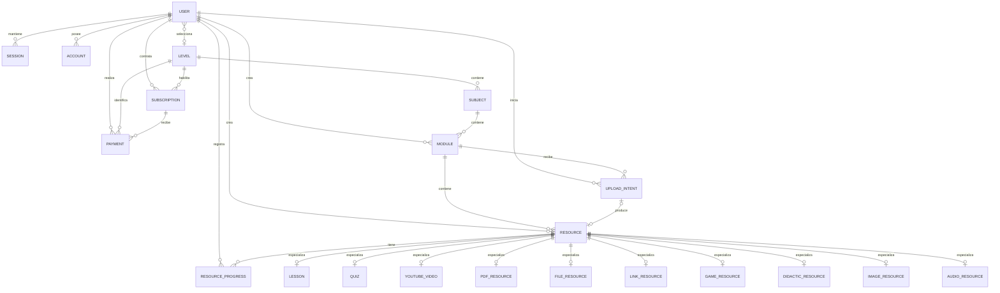

# Modelo de datos de EduNivel

## Fuente y alcance

Este documento refleja `prisma/schema.prisma` y las migraciones presentes en
`prisma/migrations/`. El proveedor es PostgreSQL y el cliente se genera con
Prisma `7.8.0`. El nombre físico de la base no está fijado en el esquema:
depende de la base seleccionada por `DATABASE_URL`.

No existe un script de seed en `package.json`. La presencia de modelos y
migraciones demuestra que la estructura está implementada, pero no demuestra
qué datos, servicios o credenciales existen en una base externa.

## Relaciones principales



`Verification`, `RateLimit` y `WebhookReceipt` no tienen claves foráneas hacia
las entidades anteriores. Su asociación es lógica mediante identificadores,
claves de limitación o IDs del proveedor.

## Autenticación y usuarios

### `User`

| Campo o regla | Descripción |
| --- | --- |
| `id` | Identificador administrado por Better Auth |
| `email @unique` | Identidad única de la cuenta |
| `emailVerified` | Bloquea el login hasta la verificación |
| `role` | `STUDENT`, `TEACHER`, `COLLABORATOR` o `ADMIN` |
| `birthDate`, `ageDeclared` | Información de edad; `birthDate` es opcional |
| `termsAcceptedAt`, `privacyAcceptedAt`, `ageVerifiedAt` | Evidencia temporal del registro |
| `selectedLevelId` | Nivel elegido para navegar; FK opcional con `onDelete: SetNull` |

También relaciona sesiones, cuentas, suscripciones, pagos, progreso, contenido
creado/revisado/publicado e intenciones de carga.

### Modelos de Better Auth

| Modelo | Función y restricciones principales |
| --- | --- |
| `Session` | Token único, vencimiento y FK a `User` con borrado en cascada |
| `Account` | Proveedor, cuenta, hash de contraseña/tokens y FK a `User` |
| `Verification` | Identificador, valor OTP y vencimiento |
| `RateLimit` | Clave única, contador y tiempo de última solicitud |

Aunque `Verification.value` es texto en PostgreSQL, Better Auth está configurado
para guardar el OTP con hash.

## Suscripciones y pagos

### `Subscription`

Representa el derecho de acceso vigente, no una transacción individual.

- pertenece a un usuario y a un nivel;
- es única por `userId + levelId`;
- guarda producto, estado, inicio y final del periodo;
- `lastPlanCode` conserva el último plan aplicado;
- puede acumular varios pagos.

El producto identifica el acceso compatible con el rol:
`STUDENT_PREMIUM` o `TEACHER_PREMIUM`. El intervalo mensual o anual no forma
parte de la identidad de la suscripción.

### `Payment`

Representa una transacción histórica y conserva una instantánea de la compra:

- `userId` y `levelId`;
- plan, producto, intervalo, duración y rol al comprar;
- monto esperado y recibido en la unidad menor;
- moneda;
- proveedor, método y modo;
- IDs retornados por ONVO;
- referencias internas únicas e idempotencia de checkout;
- estado, fechas de confirmación/aplicación y marca de intento estancado;
- solo los últimos cuatro caracteres del teléfono y de la identificación;
- código y mensaje de error sanitizados.

`Payment.levelId` es la fuente de verdad del nivel que debe desbloquear el
webhook. La suscripción relacionada es opcional hasta que el pago se aplica.
Cambiar `User.selectedLevelId` no modifica la compra.

### `WebhookReceipt`

Audita eventos recibidos mediante:

- proveedor;
- tipo de evento;
- identificador del objeto externo;
- hash del payload;
- resultado del procesamiento;
- fechas y código de error.

No existe una restricción única sobre el hash; la idempotencia del derecho de
acceso se resuelve al aplicar el pago y mediante los identificadores únicos de
`Payment`.

## Catálogo educativo

### `Level`

- número único;
- descripción opcional;
- `requiresSubscription` con valor predeterminado `true`;
- estado activo;
- materias, usuarios que lo seleccionaron, suscripciones y pagos.

El modelo actual define acceso gratuito o premium para todo el nivel. No existe
un campo de acceso gratuito por recurso.

### `Subject`

Pertenece a un nivel con borrado en cascada. El nombre es único dentro de ese
nivel mediante `@@unique([levelId, name])`. Incluye orden y estado activo.

### `Module`

Pertenece a una materia y define:

- título único dentro de la materia;
- audiencia `STUDENT`, `TEACHER` o `BOTH`;
- estado editorial;
- autor obligatorio;
- datos opcionales de envío, revisión, observación y publicación;
- orden y estado activo.

Los FKs de autor usan `Restrict`; los de revisor y publicador usan `SetNull`.

### `Resource`

Pertenece a un módulo y define tipo, título, estado editorial, autoría, revisión,
publicación, orden, estado activo y obligatoriedad.

`uploadIntentId` es opcional y único. Esto garantiza que una intención de carga
confirmada produzca como máximo un recurso. Un recurso tiene como máximo una
especialización mediante una de las tablas de tipo, aunque Prisma no expresa
con una única restricción SQL que solo una de esas diez relaciones pueda
existir.

## Flujo editorial

`Module` y `Resource` usan:

```text
DRAFT
  -> IN_REVIEW
  -> PUBLISHED
  -> UNPUBLISHED

IN_REVIEW
  -> CHANGES_REQUESTED
  -> DRAFT o nuevo envío a revisión
```

Los campos disponibles para auditoría son:

- `createdById`;
- `submittedForReviewAt`;
- `reviewedById`, `reviewedAt`, `reviewNote`;
- `publishedById`, `publishedAt`.

Las restricciones sobre quién puede ejecutar cada transición se implementan en
las Server Actions, no mediante constraints del esquema.

## Intenciones de carga R2

### `UploadIntent`

Representa una carga temporal y contiene:

- autor y módulo;
- `reservedResourceId @unique`, un UUID reservado sin FK inicial;
- tipo, título, descripción, nombre original y texto alternativo;
- claves temporal y permanente únicas;
- MIME y tamaño esperados;
- ETag observado;
- estado, expiración, confirmación y comienzo de procesamiento;
- lease de limpieza, cantidad de intentos, último intento y código de fallo.

La relación definitiva se establece desde
`Resource.uploadIntentId @unique`. Al confirmar, el recurso se crea usando
`reservedResourceId` como `Resource.id` y se conecta con la intención. Una
repetición idempotente puede devolver ese mismo recurso.

Estados:

| Estado | Significado |
| --- | --- |
| `PENDING` | URL emitida; espera carga y confirmación |
| `PROCESSING` | Una solicitud reclamó la confirmación |
| `CONFIRMED` | Recurso y objeto permanente creados |
| `CLEANUP_PENDING` | Recurso confirmado; falta limpiar el temporal |
| `FAILED` | Error registrado |
| `EXPIRED` | Intención vencida |

PostgreSQL conserva metadatos y claves. Los bytes de PDF e imágenes se almacenan
en R2 cuando esa integración está habilitada externamente.

## Tipos de recurso

Cada tabla especializada contiene un `resourceId @unique` con borrado en
cascada:

| Tipo | Tabla | Datos principales |
| --- | --- | --- |
| `LESSON` | `Lesson` | contenido y minutos estimados |
| `QUIZ` | `Quiz` | preguntas JSON, nota, intentos y mezcla |
| `YOUTUBE` | `YoutubeVideo` | ID de video y tiempos |
| `PDF` | `PdfResource` | clave R2, nombre, MIME, tamaño y páginas |
| `FILE` | `FileResource` | clave R2 y metadatos de archivo |
| `LINK` | `LinkResource` | URL y apertura en pestaña nueva |
| `GAME` | `GameResource` | tipo y configuración JSON |
| `DIDACTIC` | `DidacticResource` | contenido y objetivo |
| `IMAGE` | `ImageResource` | clave R2, dimensiones, alt y pie |
| `AUDIO` | `AudioResource` | clave R2, duración y transcripción |

El flujo de subida R2 implementado actualmente acepta únicamente `PDF` e
`IMAGE`. Que existan tablas para otros tipos no significa que todos tengan una
interfaz de creación o carga implementada.

## Progreso

`ResourceProgress` relaciona usuario y recurso de forma única. Guarda estado de
finalización, puntuación, intentos y fechas. El modelo existe, pero los
dashboards de estudiante y docente todavía muestran métricas iniciales; el
repositorio no implementa aún el cálculo completo de esas tarjetas a partir del
progreso.

## Enumeraciones

| Enum | Valores |
| --- | --- |
| `Role` | `STUDENT`, `TEACHER`, `COLLABORATOR`, `ADMIN` |
| `PlanCode` | `STUDENT_MONTHLY`, `STUDENT_YEARLY`, `TEACHER_MONTHLY`, `TEACHER_YEARLY` |
| `SubscriptionProduct` | `STUDENT_PREMIUM`, `TEACHER_PREMIUM` |
| `BillingInterval` | `MONTHLY`, `YEARLY` |
| `SubscriptionStatus` | `ACTIVE`, `CANCELED`, `EXPIRED` |
| `PaymentStatus` | `INITIALIZING`, `PROCESSING`, `SUCCEEDED`, `FAILED`, `CANCELED`, `REQUIRES_REVIEW` |
| `PaymentProvider` | `ONVO` |
| `PaymentMethod` | `SINPE_MOBILE` |
| `ProviderMode` | `TEST`, `LIVE` |
| `WebhookOutcome` | `PROCESSED`, `IGNORED`, `REQUIRES_REVIEW`, `FAILED` |
| `ContentAudience` | `STUDENT`, `TEACHER`, `BOTH` |
| `PublicationStatus` | `DRAFT`, `IN_REVIEW`, `CHANGES_REQUESTED`, `PUBLISHED`, `UNPUBLISHED` |
| `UploadStatus` | `PENDING`, `PROCESSING`, `CONFIRMED`, `CLEANUP_PENDING`, `FAILED`, `EXPIRED` |
| `ResourceType` | `LESSON`, `QUIZ`, `YOUTUBE`, `PDF`, `FILE`, `LINK`, `GAME`, `DIDACTIC`, `IMAGE`, `AUDIO` |

## Migraciones presentes

El historial contiene cinco migraciones:

1. esquema inicial;
2. modelos de pagos ONVO;
3. datos del método de pago;
4. acceso por nivel y flujo editorial;
5. intenciones de carga R2.

Para desarrollo, `pnpm db:migrate` ejecuta `prisma migrate dev`. Para aplicar
migraciones ya creadas en staging o producción,
`pnpm db:migrate:deploy` ejecuta `prisma migrate deploy`. Este último proceso
está separado de `pnpm build`.
